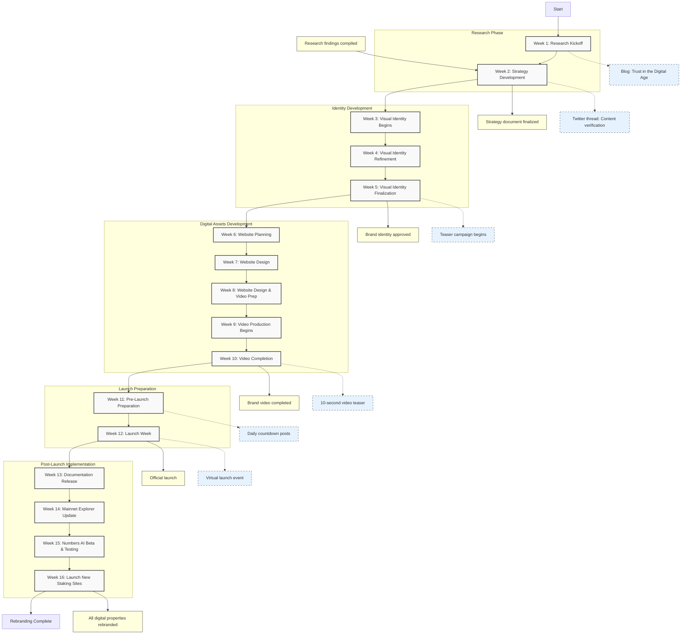

# Numbers Protocol Rebrand Project Proposal

## Objective & Strategy

Numbers Protocol is undergoing a comprehensive rebrand to position itself as the go-to solution for trustworthy digital content in the generative AI era. Key objectives:

1. **Emphasize Content Provenance in the AI Era**: Highlight the importance of content tracing and provenance as foundational to trust in an era where AI-generated content is widespread.

2. **Position Numbers Protocol as the Go-To for Builders**: Target developers, startups, and innovators who require trustworthy digital content for their applications.

3. **Leverage Key Industry Reports**: Incorporate insights from reports like NIST AI 100-4 to position Numbers Protocol as aligned with globally recognized best practices.

## Project Timeline (16 Weeks)

### Week 1: Research Kickoff
- Initial brand research and competitor analysis
- Stakeholder interviews begin
- Project kickoff meeting with Noir Agency
- Community input poll launched on social media
- **Suggested Marketing Activity:** Publish blog post "Trust in the Digital Age: Why Numbers Protocol is Evolving" to signal changes ahead without details

### Week 2: Strategy Development
- Research findings compilation
- Strategy document development
- "Trust in the AI Era" AMA with community
- Finalize project objectives and key messages
- **Suggested Marketing Activity:** Release short Twitter thread highlighting industry challenges in content verification with subtle hints about "exciting changes coming soon"

### Week 3: Visual Identity Begins
- Revisit CAPTCH-A, PFP and Brand concepts
- Typography options presented
- First tagline concepts drafted
- **Suggested Marketing Activity:** Share content authenticity statistics and research findings on LinkedIn to build awareness of the problem Numbers Protocol solves

### Week 4: Visual Identity Refinement
- Logo concept selection and refinement
- Color and typography selection
- Tagline testing with small focus group
- Begin teaser campaign planning
- **Suggested Marketing Activity:** Launch weekly "Provenance Matters" series highlighting real-world examples of deepfakes/misinformation

### Week 5: Visual Identity Finalization
- Final logo, colors, and typography approval
- Complete brand style guide draft
- Finalize tagline and core messaging
- Launch first teaser content on social media
- **Suggested Marketing Activity:** Begin social media teaser campaign with abstract visual elements from new branding (color blocks, partial shapes)

### Week 6: Website Planning
- Site architecture and user journey mapping
- Content inventory and needs assessment
- Initial wireframes for key pages
- Continue teaser campaign with blurred logo elements
- **Suggested Marketing Activity:** Release developer-focused poll asking "What features would help you integrate authenticity into your applications?"

### Week 7: Website Design
- Homepage and key landing page designs
- Navigation and UI element design
- Share first "sneak peek" with community
- Begin product interface design concepts
- **Suggested Marketing Activity:** Share first official "sneak peek" of new website interface (partial screenshot) with community

### Week 8: Website Design & Video Prep
- Complete remaining page designs
- Begin website development
- Brand video script and storyboard creation
- Community survey on desired website features
- Documentation structure planning begins
- **Suggested Marketing Activity:** Publish interview with Numbers Protocol founders about vision for content provenance in the AI era

### Week 9: Video Production Begins
- Website development continues
- Product interface design finalization
- Video production begins
- Behind-the-scenes updates shared with community
- Begin Numbers AI feature scoping and design
- **Suggested Marketing Activity:** Share behind-the-scenes content of video production with "coming soon" messaging

### Week 10: Video Completion
- Website development nears completion
- Product interface implementation begins
- Brand video production completed
- Announce video premiere date to community
- Documentation content creation begins
- **Suggested Marketing Activity:** Release 10-second teaser clip from brand video and announce official launch date across all platforms

### Week 11: Pre-Launch Preparation
- Website testing and QA
- Content upload and final adjustments
- Launch planning and materials preparation
- Pre-launch briefings with influencers and partners
- Technical documentation draft review
- **Suggested Marketing Activity:** Daily countdown posts featuring testimonials from beta testers and early partners

### Week 12: Launch Week
- Coordinated website, brand, and video launch
- Press release distribution
- Launch-day AMA and social media blitz
- Influencer content goes live
- Post-launch analytics monitoring begins
- **Suggested Marketing Activity:** Host virtual launch event featuring demo of new platform, Q&A with team, and special guest speakers from industry

### Week 13: Documentation Release
- Release technical documentation with new branding
- Numbers AI development continues
- Post-launch adjustments to website and branding assets
- Community feedback collection and analysis
- **Suggested Marketing Activity:** Developer-focused content series explaining how to use the API with updated documentation

### Week 14: Mainnet Explorer Update
- Update Numbers mainnet explorer page with new branding
- Numbers AI feature integration testing
- Prepare explorer tutorials and guides
- Continue post-launch optimizations
- **Suggested Marketing Activity:** Launch tutorial video series on how to use the refreshed explorer interface

### Week 15: Numbers AI Beta & Testing
- Numbers AI beta testing with selected partners
- Final adjustments to Numbers AI features
- Launch preparation for Numbers AI
- Staking site redesign begins
- **Suggested Marketing Activity:** "AI Provenance Challenge" campaign encouraging developers to build with Numbers AI

### Week 16: Launch New Staking Sites
- Launch Numbers AI publicly
- Complete staking site redesign
- Deploy new staking sites with improved accessibility
- Comprehensive review of all branded touchpoints
- **Suggested Marketing Activity:** Educational campaign about staking benefits with tutorials and guides for new users

## Marketing Plan

### Social Media Campaigns
- Active presence on X (Twitter), LinkedIn
- Phase-appropriate content with consistent hashtag strategy
- Focus on community engagement

### Community Engagement & AMAs
- Regular AMA sessions on relevant platforms
- Community-generated content opportunities
- Direct interaction with builders

### Influencer & Partner Collaborations
- Content collaborations with thought leaders
- Cross-promotions with partner organizations
- Joint webinars or panels on content provenance

### Content Marketing
- Blog articles, whitepapers, case studies
- Updated documentation and developer guides
- Distribution through relevant tech platforms

### Builder-Focused Outreach
- Participation in hackathons or developer meetups
- Targeted messaging in developer communities
- Goal: double social media following by campaign end

## Key Deliverables

### Brand Visual Update
- Updated logo, color scheme, typography
- Official brand style guide
- Refined tagline and messaging

### Website Redesign and Product UI
- Fully redesigned website with improved UX
- Built on user-friendly platform (e.g., Webflow)
- Product interface refresh to match new branding

### Brand Story Video
- 60-90 second high-quality video
- Multiple formats for different platforms
- Centerpiece for launch campaign

## Roles and Responsibilities

### Noir Agency
- Lead creative strategy and execution
- Project management and regular communication
- Revisions and quality assurance
- Launch technical support

### Numbers Protocol
- Provide necessary content and input
- Deliver timely feedback and approvals
- Lead community and marketing efforts
- Coordinate launch and post-launch activities

## Measurement of Success

- Website traffic and engagement metrics
- Social media growth (goal: 2× follower count)
- Community feedback and sentiment
- Builder engagement (API sign-ups, partnership inquiries)
- Media and industry recognition

*Post-launch review will assess all metrics to determine success and inform future strategy.*
